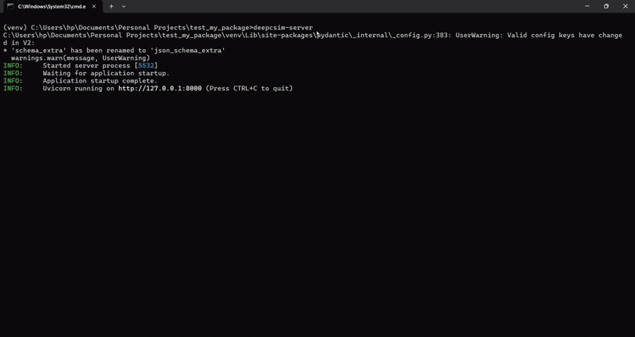

# DeepCSIM - Code Similarity Analyzer

DeepCSIM is a Python library and tool for analyzing code similarity between Python files using Abstract Syntax Tree (AST) analysis. It can detect structural and semantic similarities.




## Installation

```bash
pip install deepcsim
```

## Usage

You can use DeepCSIM in three ways: as a command-line tool, as a local web server, or as a Python library.

### 1. CLI Tool

Scan a directory for code duplicates directly from your terminal.

```bash
# Scan current directory
deepcsim-cli

# Scan a specific directory
deepcsim-cli /path/to/project

# Set similarity threshold (default: 80.0)
deepcsim-cli /path/to/project --threshold 90

# Output results in JSON format
deepcsim-cli /path/to/project --json
```

### 2. Web Server

Start the built-in web interface to view results interactively.

```bash
deepcsim-server
```

Then open http://localhost:8000/ in your browser.

### 3. Python Library

Use DeepCSIM programmatically in your Python scripts.

```python
from deepcsim import compare_source
from deepcsim.core.analyzer import CodeAnalyzer # Optional, for advanced usage

# --- Example 1: Compare two code snippets (Easy Way) ---

source1 = """
def hello():
    print("Hello world")
"""

source2 = """
def greet():
    print("Hello world")
"""

# Compare directly
report = compare_source(source1, source2)
# The report contains full details, similar to scan_directory output
print(f"Similarity: {report['results'][0]['similarity']}%")

# --- Example 2: Scan a directory ---

results = scan_directory("/path/to/project", threshold=80.0)
print(f"Found {results['count']} similar pairs.")
```

## API

If running the server, you have access to the following endpoints:

- `GET /` — Web interface for browsing project files and scanning directories
- `POST /api/file-info/` — Get metadata and similar files for a specific file
- `POST /scan-project` — Recursively scan a directory for duplicate/similar files (JSON response)
